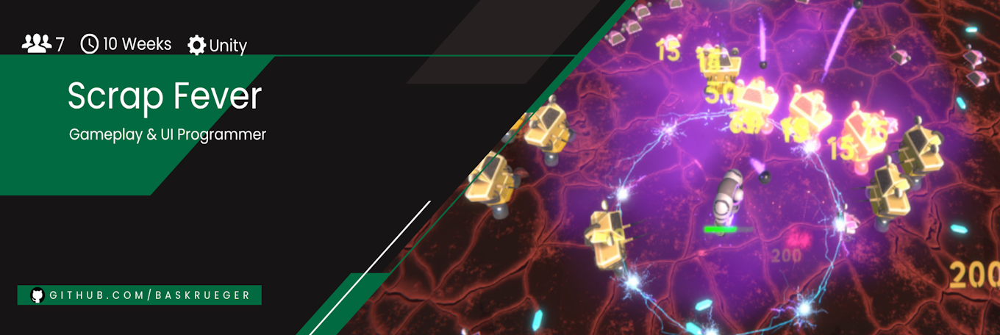
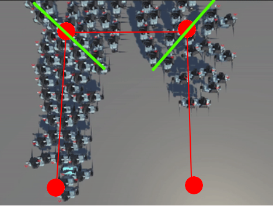

# ScrapFever

     

Scrap Fever was developed during my 3. Semester at the [S4G School for Games](https://www.school4games.net/) using C# and the Unity Engine. This project had quite a turbulent development with members leaving the team, multiple smaller and one major change in direction for both art and gamedesign. 

# Gameplay

https://github.com/BasKrueger/ScrapFever/assets/147401575/f4464f64-03d1-4a6e-9401-09cc836a0a09

Scrap Fever is a futuristic Survivor-Like set in a magma cave where runs only last 6 extremely varied minutes. You play as a robot with weapons that automatically fire at the next enemy. Defeated enemies leave crystals behind, collect enough of them to either upgrade or get a new or unlock a completely new weapon. Combining lightning fast reflexes with strategically picking the correct upgrades is key to surviving these intense 6 Minutes.
Features include:
  - 10 different weapons
  - 3 Bosses with unique mechanics
  - 72 Achievments
  - multi-language support

# How to run
Clone this repository and open the project folder using at least Unity Version 2022.3.5. Alternatively you can try out the game in your browser on our [itch.io page](https://suchti0352.itch.io/scrap-fever) where you can also find a download to the Android apk or Windows exe.  

# Highlight: Horde pathing

  
   

Originally the game used to have a tower defense component to it, where you had to defend a energy generator instead of yourself. For this purpose I created a horde enemy pathing which needed to be easy to handle for designers and able to keep enemies as hordes, while being performance friendly. All the designers have to do is to define a set path based on waypoints, enemies would then move alongside this ideal path, without stepping directly on it. This feature required quite a bit of vector math, but in short the system works like this:
- First the system find the closest waypoint (red circle) from the recently spawned enemy
- It then calculates the vectors of the ideal path (red line) from that point onwards, aswell as target vectors (green line) based on paralels and the enemy distance of the ideal path (red line)
-  Enemies then continuously move towards the closest point of the next target vector (green line), until they cross it by either moving or getting pushed across it. They then continue doing this towards the next target vector (green line) until they reach the end of the ideal path

# My responsibilities in this project included:
- Horde Pathing
- Custom Pooling
- Weapons
- Achievements
- UI Programming
- Balancing (during the second half of the project)
- Level Design (during the second half of the project)
